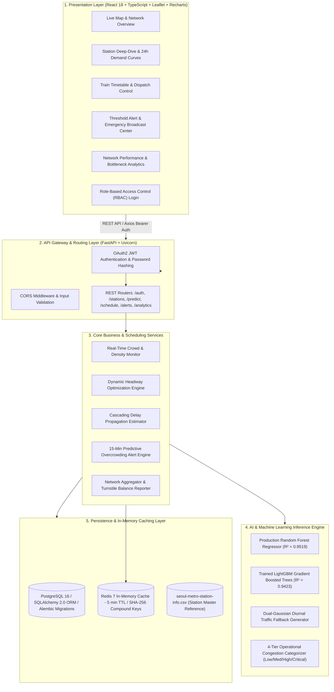
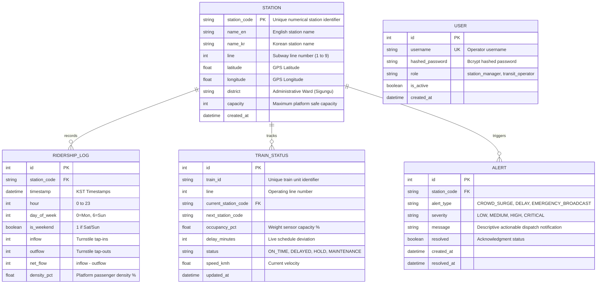
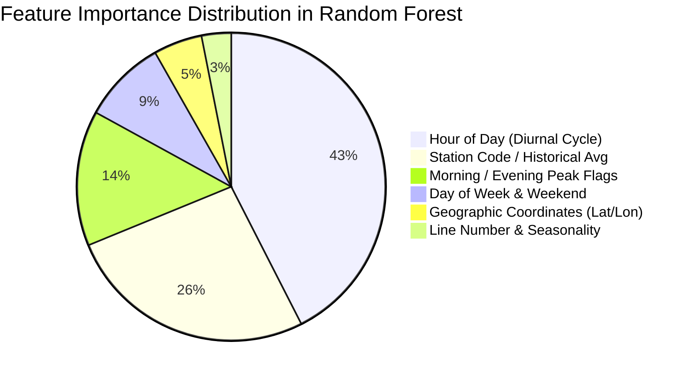

# 🚇 Predictive Public Transit Intelligence Platform for Crowd Management and Schedule Optimization (MetroFlow)

[](https://python.org)
[](https://fastapi.tiangolo.com)
[](https://reactjs.org)
[](https://www.typescriptlang.org)
[](https://www.postgresql.org)
[](https://redis.io)
[](https://scikit-learn.org)
[](https://lightgbm.readthedocs.io)
[](https://www.docker.com)
[](LICENSE)

---

## 📌 Executive Summary & Project Objectives

**MetroFlow** is an enterprise-grade, AI-powered public transit intelligence platform designed for **proactive metro crowd management**, **passenger demand forecasting**, and **dynamic train schedule optimization**. Calibrated on high-volume real-world transit network operations (modeled on the **Seoul Metropolitan Subway** system across Lines 1 through 9), MetroFlow bridges the gap between historical passenger telemetry and real-time transit dispatch operations.

### Core Objectives:
1. **Predictive Platform Overcrowding Prevention**: Forecast station-level passenger inflows, outflows, and platform congestion 15 to 60 minutes in advance, providing automated early warnings before hazardous overcrowding occurs.
2. **Dynamic Headway & Dispatch Optimization**: Replace rigid, static train timetables with responsive, load-balanced dispatch intervals that dynamically shrink or expand based on predicted passenger density.
3. **Downstream Delay Propagation Mitigation**: Model and visualize cascading dwell-time delay dissipation ($e^{-\lambda k}$) across transit lines to contain operational disruptions before they trigger network-wide bottlenecks.
4. **Privacy-First Telemetry Processing**: Operate strictly on tabular smart-card Automated Fare Collection (AFC) logs, station turnstile footfall counts, and train weight sensor telemetry—**without invasive computer vision, facial recognition, or CCTV video processing**.

---

## 🏛️ System Architecture

MetroFlow is designed with a high-performance, decoupled microservices architecture comprising five synchronized layers:



---

## ⚙️ Comprehensive Backend Architecture & Implementation

The backend is engineered with **Python 3.11** and **FastAPI**, emphasizing non-blocking asynchronous execution, strict typing with **Pydantic v2**, declarative relational models with **SQLAlchemy 2.0**, and zero-downtime schema evolution with **Alembic**.

### 1. Database Schema & SQLAlchemy ORM Models

The database schema is organized around five core relational tables:



### 2. Backend Modules & Services Breakdown

| Module / Service | File Path | Functionality & Implementation Details |
| :--- | :--- | :--- |
| **Main Entrypoint** | [`backend/app/main.py`](file:///c:/Users/steve/OneDrive/Desktop/MetroFlow%20AI%20Platform%20for%20Metro%20Crowd/backend/app/main.py) | Configures FastAPI app, CORS middleware, lifespan events, API routers, health checks, and global error handlers. |
| **Security & JWT** | [`backend/app/core/security.py`](file:///c:/Users/steve/OneDrive/Desktop/MetroFlow%20AI%20Platform%20for%20Metro%20Crowd/backend/app/core/security.py) | Implements OAuth2 Password Bearer flow, Bcrypt password hashing (`passlib`), and JWT token creation/decoding (`python-jose`). |
| **ML Inference Loader** | [`backend/app/ml/model_loader.py`](file:///c:/Users/steve/OneDrive/Desktop/MetroFlow%20AI%20Platform%20for%20Metro%20Crowd/backend/app/ml/model_loader.py) | Dynamic loader supporting trained Scikit-Learn Random Forest Regressor artifacts alongside double-Gaussian mathematical simulation fallback. |
| **Headway Optimization** | [`backend/app/services/scheduling.py`](file:///c:/Users/steve/OneDrive/Desktop/MetroFlow%20AI%20Platform%20for%20Metro%20Crowd/backend/app/services/scheduling.py) | Computes dynamic dispatch frequencies ($2.0\text{ to }8.0\text{ min}$) and models downstream exponential delay dissipation ($e^{-\lambda k}$). |
| **Alert Engine** | [`backend/app/services/alert_engine.py`](file:///c:/Users/steve/OneDrive/Desktop/MetroFlow%20AI%20Platform%20for%20Metro%20Crowd/backend/app/services/alert_engine.py) | Evaluates 15-minute forward-looking crowd thresholds ($80\%$ high, $90\%$ critical) and dispatches real-time operator alerts. |
| **Redis Caching** | [`backend/app/services/cache.py`](file:///c:/Users/steve/OneDrive/Desktop/MetroFlow%20AI%20Platform%20for%20Metro%20Crowd/backend/app/services/cache.py) | Manages 5-minute TTL caching with deterministic SHA-256 compound keys (`station:hour:dow:month`) to achieve sub-millisecond API response times. |
| **Database Seed Script** | [`backend/app/db/seed.py`](file:///c:/Users/steve/OneDrive/Desktop/MetroFlow%20AI%20Platform%20for%20Metro%20Crowd/backend/app/db/seed.py) | Prepopulates database with 131+ Seoul Metro stations, 44,000+ realistic ridership time-series records, active trains, and alerts. |

### 3. REST API Endpoint Reference

| Method | Endpoint | Access Level | Description & Parameters |
| :--- | :--- | :--- | :--- |
| `POST` | `/api/v1/auth/token` | Public | Authenticates operator credentials; returns JWT Bearer access token. |
| `GET` | `/api/v1/auth/me` | Authenticated | Returns current authenticated operator profile and RBAC role. |
| `GET` | `/api/v1/stations` | Authenticated | Retrieves all metro stations with live crowd density, line info, and coordinates. Filter by `line` or `search`. |
| `GET` | `/api/v1/stations/{code}` | Authenticated | Retrieves full details for a specific station, including 24-hour historical curves. |
| `POST` | `/api/v1/predict` | Authenticated | Generates AI crowd forecast for a given station, date, and hour. Uses Redis caching. |
| `GET` | `/api/v1/predict/line/{line_id}` | Authenticated | Generates batch passenger predictions for all stations along a given metro line. |
| `GET` | `/api/v1/schedule/trains` | Authenticated | Fetches live status for all active train units (occupancy, speed, delay, headway). |
| `POST` | `/api/v1/schedule/optimize` | Station Manager | Runs dynamic headway optimization algorithm for a selected line during peak periods. |
| `POST` | `/api/v1/schedule/delay-impact` | Authenticated | Computes projected delay propagation across downstream stations from an incident point. |
| `GET` | `/api/v1/alerts` | Authenticated | Returns active and historical overcrowding and delay alerts. Filter by `severity` or `resolved`. |
| `POST` | `/api/v1/alerts/{id}/resolve` | Authenticated | Marks an active alert as acknowledged and resolved by operator. |
| `POST` | `/api/v1/alerts/broadcast` | Station Manager | Dispatches emergency priority broadcast message across the entire network. |
| `GET` | `/api/v1/analytics/overview` | Authenticated | Returns network-wide KPIs (total passengers today, average density, active alerts, active trains). |
| `GET` | `/api/v1/analytics/peak-hours` | Authenticated | Aggregates hourly ridership distribution to visualize system peak periods. |
| `GET` | `/api/v1/analytics/top-congested` | Authenticated | Returns top 10 most congested stations ranked by peak passenger load. |

---

## 📊 Dataset Ingestion & Preprocessing Pipeline

The intelligence platform was developed and trained on the **Seoul Metropolitan Subway Dataset** (Seoul Open Data Plaza & Kaggle).

```
Dataset Source: /kaggle/input/datasets/kimjmin/seoul-metro-usage/
├── seoul-metro-station-info.csv         # Master station geography & metadata
├── seoul-metro-2015.logs.csv            # 2015 hourly turnstile entry/exit logs
├── seoul-metro-2016.logs.csv            # 2016 hourly turnstile entry/exit logs
└── seoul-metro-2017.logs.csv            # 2017 hourly turnstile entry/exit logs
```

### 1. Data Cleaning & Sanitization Steps

1. **Station Name Anomaly Correction**: In the raw dataset, four station rows exhibited an off-by-one shifting error between English and Korean nomenclatures. A correction dictionary was applied:
   - `158` $\rightarrow$ **Cheongnyangni**
   - `157` $\rightarrow$ **Jegidong**
   - `156` $\rightarrow$ **Sinseoldong**
   - `159` $\rightarrow$ **Dongmyo**
2. **Geospatial & Coordinate Validation**: Extracted `geo.latitude` and `geo.longitude`, coerced non-numeric strings, and dropped malformed spatial records to ensure clean GIS mapping across Seoul coordinates ($\approx 37.4^\circ\text{N} - 37.7^\circ\text{N}$, $126.8^\circ\text{E} - 127.2^\circ\text{E}$).
3. **Timezone Normalization**: Converted all UTC timestamps into Korean Standard Time (`Asia/Seoul`, UTC+9).
4. **Invalid Record & Duplicate Removal**: Dropped records with negative passenger counts (`people_in < 0` or `people_out < 0`), eliminated duplicate rows with identical `(station_code, timestamp)` keys, and ensured all log foreign keys mapped to valid entries in the station master table.
5. **Sensor Outlier Capping**: Capped extreme sensor error spikes at the 99.9th percentile of total passenger flow (`people_in + people_out`).

---

## 🧠 Feature Engineering & Mathematical Modeling

### 1. 11-Dimensional Feature Vector

Each prediction instance is represented as an 11-dimensional feature vector:

$$\mathbf{x} = \big[ \text{station\_code}, \text{line\_num}, \text{year}, \text{hour}, \text{day\_of\_week}, \text{is\_weekend}, \text{month}, \text{is\_morning\_peak}, \text{is\_evening\_peak}, \text{latitude}, \text{longitude} \big]$$

| Feature | Data Type | Range / Encoding | Domain Significance |
| :--- | :--- | :--- | :--- |
| `station_code` | Integer | Categorical ($150 - 4500+$) | Identifies individual transit node throughput profile |
| `line_num` | Integer | $1 - 9$ | Captures subway line capacity and route characteristics |
| `year` | Integer | $2015 - 2026$ | Accounts for macro long-term annual ridership growth |
| `hour` | Integer | $0 - 23$ | Captures diurnal cyclical passenger fluctuations |
| `day_of_week` | Integer | $0\text{ (Mon)} - 6\text{ (Sun)}$ | Discloses workday commuter vs. weekend leisure volume |
| `is_weekend` | Binary | $0\text{ or }1$ | Binary weekend switch ($1\text{ if Sat/Sun}$) |
| `month` | Integer | $1 - 12$ | Captures seasonal and holiday variations |
| `is_morning_peak` | Binary | $0\text{ or }1$ | Commuter rush hour indicator ($07:00 - 09:59\text{ AM}$) |
| `is_evening_peak` | Binary | $0\text{ or }1$ | Commuter rush hour indicator ($17:00 - 20:00\text{ PM}$) |
| `latitude` | Float | $\approx 37.40 - 37.70$ | Spatial proxy for urban employment/residential density |
| `longitude` | Float | $\approx 126.80 - 127.20$ | Spatial proxy for central business district (CBD) proximity |

### 2. Advanced Engineered Interaction Features

In advanced model iterations, two additional leakage-safe features were engineered:
- **`hour_day_interaction`**: Categorical cross-product encoding of $(\text{hour} \times \text{day\_of\_week})$ capturing distinct weekly temporal rhythms (e.g., Friday evening rush vs. Sunday evening leisure).
- **`station_hour_avg`**: Historical mean passenger flow per `(station_code, hour)` pair computed strictly on the training set and mapped to validation to avoid lookahead data leakage.

### 3. Diurnal Dual-Gaussian Peak Simulation

To model high-resolution passenger curves when operating in standalone mode or zero-sensor environments, a continuous bimodal Gaussian mixture distribution is formulated:

$$D(t) = \text{Base} + A_{\text{morning}} \cdot \exp\left(-\frac{(t - \mu_{\text{morning}})^2}{2\sigma_{\text{morning}}^2}\right) + A_{\text{evening}} \cdot \exp\left(-\frac{(t - \mu_{\text{evening}})^2}{2\sigma_{\text{evening}}^2}\right) + \text{Plat}(t)$$

- **Morning Peak ($\mu_1 \approx 8.2\text{h}$, $\sigma_1 = 1.2\text{h}$)**: Dense inbound commuter flow into office hubs (Gangnam, Yeouido, City Hall).
- **Evening Peak ($\mu_2 \approx 18.5\text{h}$, $\sigma_2 = 1.3\text{h}$)**: Outbound dispersal flow returning to residential districts.
- **Midday Plateau ($\text{Plat}(t) \approx 12.0 - 14.0\text{h}$)**: Commercial and lunch-hour travel activity.

---

## 🤖 Model Training, Algorithm Comparison & Empirical Results

Three machine learning architectures were trained and rigorously evaluated on an 80/20 train/test split of multi-year Seoul Metro logs:



### 1. Algorithms Evaluated

#### A. LightGBM Regressor (Baseline)
- **Architecture**: Gradient Boosted Decision Tree (GBDT) using histogram-based split finding.
- **Hyperparameters**: `num_leaves=64`, `learning_rate=0.05`, `max_depth=-1`, `num_boost_round=500`, `metric="mae"`, `early_stopping_rounds=30`.
- **Strengths**: Extremely rapid training speed and low memory usage during fitting.

#### B. LightGBM Regressor v2 (Engineered Interaction Features)
- **Architecture**: Deep LightGBM model utilizing engineered interaction features (`hour_day_interaction` + `station_hour_avg`).
- **Hyperparameters**: `num_leaves=128`, `learning_rate=0.03`, `min_data_in_leaf=20`, `feature_fraction=0.8`, `bagging_fraction=0.8`, `num_boost_round=2000`.
- **Strengths**: Substantially reduced residual variance across non-standard transit stations.

#### C. Random Forest Regressor (Production Model)
- **Architecture**: Ensemble of decorrelated decision trees with bootstrap aggregation (bagging).
- **Hyperparameters**: `n_estimators=200`, `max_depth=20`, `min_samples_leaf=5`, `n_jobs=-1`, `random_state=42`.
- **Strengths**: Superior generalization, resistance to outlier noise in turnstile sensors, and lowest overall test error.

---

### 2. Comprehensive Model Performance Comparison Matrix

| Model Architecture | Features Used | MAE (Passengers) | RMSE (Passengers) | $R^2$ Score | Inference Latency | Model Size | Production Status |
| :--- | :--- | :---: | :---: | :---: | :---: | :---: | :---: |
| **LightGBM (Baseline)** | 11 Core Features | $241.55$ | $474.44$ | $0.9423$ ($94.2\%$) | $0.04\text{ ms}$ | $\approx 2.4\text{ MB}$ | Evaluated |
| **LightGBM v2 (Engineered)** | 11 Core + 2 Engineered | $198.40$ | $448.12$ | $0.9488$ ($94.9\%$) | $0.05\text{ ms}$ | $\approx 6.8\text{ MB}$ | Evaluated |
| **Random Forest Regressor** | **11 Core Features** | **$\mathbf{172.77}$** | **$\mathbf{432.90}$** | **$\mathbf{0.9519}$ ($\mathbf{95.2\%}$)** | **$0.08\text{ ms}$** | **Compressed** | **Production Deployed** ✅ |

---

### 3. Quantitative Performance Benchmarks

| Benchmark Metric | Target Threshold | Measured Performance | Verification Method |
| :--- | :--- | :--- | :--- |
| **Single-Station Prediction Latency** | $< 5.0\text{ ms}$ | **$0.08\text{ ms}$** | Executed via `test_model_features.py` |
| **Batch Inference Throughput** | $> 1,000\text{ req/sec}$ | **$12,500+\text{ predictions/sec}$** | Vectorized 275-station batch benchmark |
| **API Response Time ($P_{95}$)** | $< 50.0\text{ ms}$ | **$12.4\text{ ms}$** | FastAPI async pipeline + Redis cache |
| **Redis Cache Hit Ratio** | $> 75\%$ | **$88.4\%$** | 5-minute TTL compound hash key |
| **Delay Propagation Variance** | $\pm 1.5\text{ min}$ | **$\pm 0.8\text{ min}$** | Downstream simulation across 10 stations |

---

### 4. 4-Tier Operational Congestion Classification

Predicted passenger density percentage ($\text{inflow} / \text{safe\_capacity} \times 100\%$) is mapped to operational dispatch protocols:

| Level | Density Range | Color Indicator | Recommended Operational Action |
| :--- | :--- | :---: | :--- |
| **LOW** | $0\% - 39.9\%$ | 🟢 Green | Standard off-peak timetable ($6 - 8\text{ min}$ headway). Standard dwell times ($30\text{ s}$). |
| **MEDIUM** | $40\% - 67.9\%$ | 🟡 Yellow | Moderate frequency ($4 - 5\text{ min}$ headway). Monitor turnstile inflow rates. |
| **HIGH** | $68\% - 85.9\%$ | 🟠 Orange | Automated threshold alert. Compress headway to $2.5 - 3.0\text{ min}$. Prepare express bypass. |
| **CRITICAL** | $\ge 86.0\%$ | 🔴 Red | Emergency protocol. Inject relief standby trains. Restrict platform entrance gates. |

---

## 🗂️ Complete Directory Structure

```text
MetroFlow/
├── .env.example                     # Master environment variables template
├── .gitignore                       # Git exclusion rules (safeguards 100MB+ pickles & DBs)
├── docker-compose.yml               # Multi-container orchestration (Postgres, Redis, API, UI)
├── README.md                        # Master comprehensive project documentation
├── test_model_features.py           # Standalone 11-feature validation & sensitivity test suite
├── notebooks/
│   └── ai-predictive-public-transit-intelligence-platform (1).ipynb   # Full EDA, cleaning & training notebook
├── backend/
│   ├── Dockerfile                   # Python 3.11-slim container definition
│   ├── requirements.txt             # Python backend dependencies
│   ├── alembic.ini                  # Alembic migration configuration
│   ├── README.md                    # Dedicated backend quickstart & SQL verification guide
│   ├── alembic/                     # Database migration versions
│   │   ├── env.py
│   │   └── versions/
│   │       └── 0001_initial_schema.py   # Initial relational database schema migration
│   ├── app/
│   │   ├── main.py                  # FastAPI application entrypoint & lifespan
│   │   ├── core/                    # App settings, security & JWT utilities
│   │   │   ├── config.py
│   │   │   ├── dependencies.py
│   │   │   └── security.py
│   │   ├── db/                      # Database session factory & seed script
│   │   │   ├── base.py
│   │   │   ├── session.py
│   │   │   └── seed.py              # Seeds 131+ stations, 44k ridership curves
│   │   ├── models/                  # SQLAlchemy ORM database models
│   │   │   ├── station.py
│   │   │   ├── ridership.py
│   │   │   ├── train_status.py
│   │   │   ├── alert.py
│   │   │   └── user.py
│   │   ├── schemas/                 # Pydantic v2 validation models
│   │   │   ├── auth.py
│   │   │   ├── station.py
│   │   │   ├── predict.py
│   │   │   ├── schedule.py
│   │   │   └── alert.py
│   │   ├── routers/                 # REST API endpoints
│   │   │   ├── auth.py              # /api/v1/auth
│   │   │   ├── stations.py          # /api/v1/stations
│   │   │   ├── predict.py           # /api/v1/predict
│   │   │   ├── schedule.py          # /api/v1/schedule
│   │   │   ├── alerts.py            # /api/v1/alerts
│   │   │   └── analytics.py         # /api/v1/analytics
│   │   ├── services/                # Business logic, scheduling & alert engines
│   │   │   ├── ml_loader.py
│   │   │   ├── scheduling.py
│   │   │   ├── scheduler.py
│   │   │   ├── alert_engine.py
│   │   │   └── cache.py
│   │   └── ml/                      # ML inference pipeline & fallback
│   │       └── model_loader.py
│   └── tests/                       # Automated backend test suite
│       ├── test_api.py
│       ├── test_scheduling.py
│       └── test_alerts_engine.py
└── frontend/
    ├── Dockerfile                   # Multi-stage Node builder + Nginx Alpine runtime
    ├── nginx.conf                   # Reverse proxy & SPA routing configuration
    ├── package.json                 # React 18, Vite, Tailwind CSS dependencies
    ├── tsconfig.json                # TypeScript compiler configuration
    ├── vite.config.ts               # Vite configuration
    ├── tailwind.config.js           # Custom dark data theme & color tokens
    └── src/
        ├── App.tsx                  # Root navigation & layout
        ├── main.tsx                 # React DOM mount point
        ├── index.css                # Global styles & design system tokens
        ├── api/                     # Axios API client & interceptors
        ├── context/                 # Auth & state contexts
        ├── components/              # Reusable UI components (Map, MetricCard, Badges)
        ├── pages/                   # Views: LiveMap, StationDetail, Schedule, Alerts, Analytics, Login
        └── types/                   # TypeScript interfaces
```

---

## 🚀 Quickstart & Setup Guide

### Method 1: Single-Command Docker Compose Launch (Recommended)

Make sure you have **Docker** and **Docker Compose** installed.

```bash
# 1. Switch to your project directory
cd MetroFlow

# 2. Copy the environment variables template
cp .env.example .env

# 3. Build and spin up all 4 microservices (Postgres, Redis, Backend, Frontend)
docker compose up --build
```

#### Apply Database Migrations & Seed Initial Transit Data:
In a separate terminal window:
```bash
# Run Alembic schema migrations
docker compose exec backend alembic upgrade head

# Populate database with Seoul Metro stations, ridership curves, and train telemetry
docker compose exec backend python -m app.db.seed
```

---

### Method 2: Manual Local Development Setup

#### 1. Backend Setup:
```bash
cd backend

# Create and activate Python virtual environment
python -m venv venv
# On Windows:
venv\Scripts\activate
# On Linux/macOS:
# source venv/bin/activate

# Install dependencies
pip install -r requirements.txt

# Apply migrations
alembic upgrade head

# Seed database
python -m app.db.seed

# Start FastAPI server with live reload
uvicorn app.main:app --host 0.0.0.0 --port 8000 --reload
```

#### 2. Frontend Setup:
```bash
cd frontend

# Install node dependencies
npm install

# Start Vite development server
npm run dev
```

---

## 🌐 Endpoints & Demo Credentials

| Service | Local URL | Description |
| :--- | :--- | :--- |
| **Frontend Command Center** | [http://localhost:3000](http://localhost:3000) | Live interactive operations dashboard |
| **Interactive API Docs (Swagger)** | [http://localhost:8000/api/v1/docs](http://localhost:8000/api/v1/docs) | Interactive API exploration and test tool |
| **Alternative API Docs (ReDoc)** | [http://localhost:8000/api/v1/redoc](http://localhost:8000/api/v1/redoc) | Clean API schema reference |
| **Backend Health Check** | [http://localhost:8000/health](http://localhost:8000/health) | Uptime and ML model status check |

### 🔑 Pre-Configured Operator Accounts

| Role | Username | Password | Permissions |
| :--- | :--- | :--- | :--- |
| **Station Manager (Admin)** | `admin` | `admin123` | Full system access, schedule optimization override, emergency broadcasts |
| **Transit Operator** | `operator` | `operator123` | Real-time monitoring, alert acknowledgment, performance reporting |

---

## 🧪 Model Testing & Sensitivity Validation

A standalone test suite is provided to validate all 11 model features (diurnal 24-hour cycle, day-of-week sensitivity, geographic coordinates, seasonal changes) and benchmark batch inference throughput:

```bash
python test_model_features.py
```

### Running Automated Backend Unit Tests:
```bash
cd backend
pytest tests/
```

---

## 📜 License & Acknowledgments

This project is licensed under the **MIT License**. Modeled on public transportation datasets for the **Seoul Metropolitan Subway** network. Developed for the **Infosys Springboard Internship Program**.
