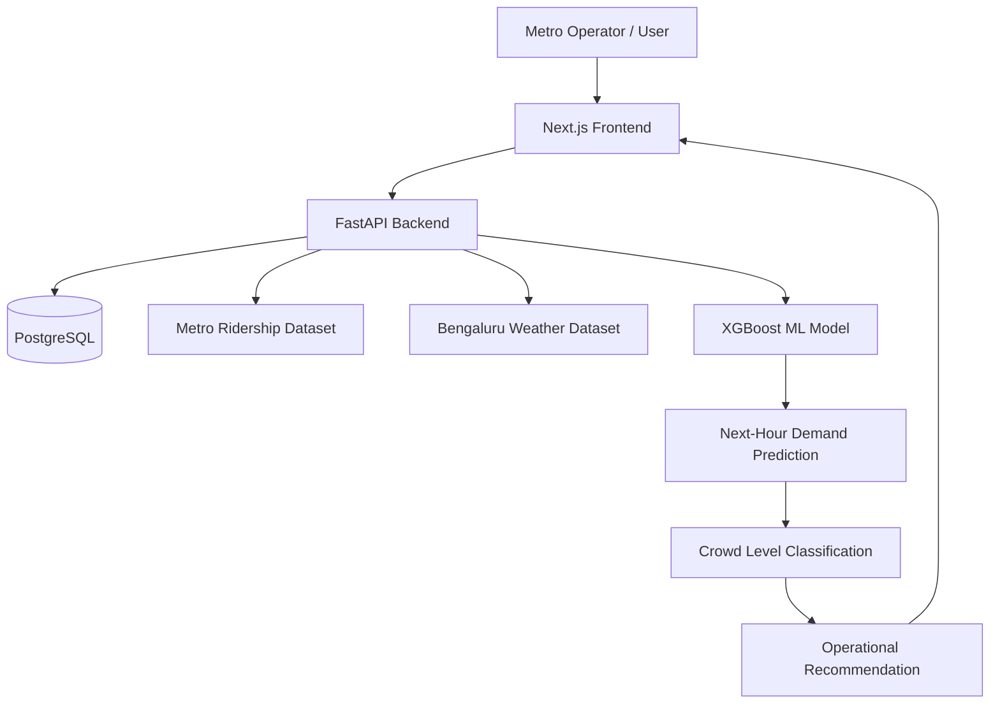

# 🚇 MetroFlow

## AI-Powered Metro Crowd Management and Schedule Optimization

MetroFlow is an AI-powered decision-support platform designed to analyze metro passenger demand, monitor station congestion, predict next-hour ridership, and provide operational recommendations for effective crowd management and scheduling.

The platform combines historical Namma Metro station-wise ridership data, machine learning, weather information, PostgreSQL, FastAPI, and a modern Next.js dashboard to provide data-driven transportation insights.

---

## 🎯 Problem Statement

Metro stations experience significant variations in passenger demand throughout the day, particularly during peak hours.

Traditional monitoring approaches may not provide sufficient predictive insights for identifying upcoming crowding conditions.

MetroFlow addresses this problem by:

- Analyzing historical station-wise ridership
- Identifying peak demand periods
- Monitoring station congestion
- Predicting next-hour passenger demand
- Classifying crowd levels
- Providing operational recommendations
- Combining transportation and weather insights

---

# 🏗️ System Architecture

```mermaid
flowchart TB

    U[Metro Operator / User]

    U --> F[Next.js Frontend]

    F --> A[FastAPI Backend]

    A --> DB[(PostgreSQL)]

    A --> D[Metro Ridership Dataset]

    A --> W[Bengaluru Weather Dataset]

    A --> ML[XGBoost ML Model]

    ML --> P[Next-Hour Demand Prediction]

    P --> C[Crowd Level Classification]

    C --> R[Operational Recommendation]

    R --> F
```

## 🛠️ Technology Stack
### Frontend
- Next.js
- React
- TypeScript
- CSS

### Backend
- Python
- FastAPI
- Uvicorn
- Pydantic

### Database
- PostgreSQL

### Machine Learning
- XGBoost
- Scikit-learn
- Pandas
- NumPy

### Data Analysis
- Jupyter Notebook
- Pandas
- Matplotlib

### Development Tools
- VS Code
- Git
- GitHub
- PowerShell### Frontend
- Next.js
- React
- TypeScript
- CSS

### Backend
- Python
- FastAPI
- Uvicorn
- Pydantic

### Database
- PostgreSQL

### Machine Learning
- XGBoost
- Scikit-learn
- Pandas
- NumPy

### Data Analysis
- Jupyter Notebook
- Pandas
- Matplotlib

### Development Tools
- VS Code
- Git
- GitHub
- PowerShell

## 📁 Project Structure

```text
MetroFlow/
├── ai/
│   └── dataset_analysis.ipynb
├── backend/
│   ├── main.py
│   └── station.py
├── frontend/
│   └── app/
│       ├── page.tsx
│       ├── layout.tsx
│       └── globals.css
├── datasets/
│   ├── raw/
│   │   ├── station-hourly.csv
│   │   ├── station-hourly-exits.csv
│   │   └── bengaluru-weather-2025.csv
│   └── processed/
│       └── metroflow_predictions.csv
├── database/
├── docs/
└── models/
```

## 💡 Solution Overview

MetroFlow processes historical metro ridership data and generates actionable insights through a web-based dashboard.

```text
Historical Metro Data
        │
        ▼
Data Preprocessing
        │
        ▼
Feature Engineering
        │
        ▼
XGBoost Prediction Model
        │
        ▼
Next-Hour Demand Prediction
        │
        ▼
Crowd Level Classification
        │
        ▼
Operational Recommendation
        │
        ▼
MetroFlow Dashboard
```
