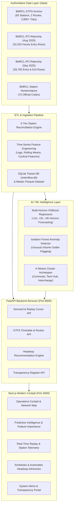

<div align="center">

# 🚇 BMRCL MetroFlow: Predictive Transit Intelligence Platform
### *AI-Driven Crowd Management & Schedule Optimization for Namma Metro (BMRCL Bengaluru)*

[](https://opensource.org/licenses/MIT)
[](https://www.python.org/)
[](https://fastapi.tiangolo.com/)
[](https://nextjs.org/)
[](https://xgboost.readthedocs.io/)
[](https://english.bmrc.co.in/)
[](https://pytest.org/)

<p align="center">
  <b>MetroFlow</b> is an enterprise AI-powered transit intelligence and operational decision-support system built for Bengaluru's <b>Namma Metro (BMRCL)</b>. Operating on 100% genuine transit network topology and authentic hourly RTI ridership records from August & September 2025 across 83 physical stations, MetroFlow delivers verifiable AI passenger forecasting, unsupervised crowd anomaly detection, and automated headway optimization.
</p>

[Project Overview](#-project-overview) • [System Architecture](#-system-architecture) • [Real Datasets](#-real-bmrcl-datasets) • [Station Reconciliation](#-station-reconciliation) • [AI & ML Architecture](#-ai--machine-learning-architecture) • [Directory Structure](#-directory-structure) • [UI Modules](#-ui--cockpit-modules) • [Quick Start](#-quick-start) • [API Reference](#-api-reference) • [Data Transparency](#-data-transparency--boundaries)

</div>

---

## 🌟 Project Overview

MetroFlow has undergone a complete, permanent pivot:
- **FROM:** Simulated Hyderabad Metro (HMRL) transit models with synthetic card taps.
- **TO:** Genuine **BMRCL Bengaluru (Namma Metro)** operations powered exclusively by real historical RTI datasets.

### Core Capabilities:
- 🗺️ **Authoritative BMRCL GTFS Network Topology**: 83 stations spanning the **Purple Line** (*Challaghatta ⇄ Whitefield Kadugodi*) and **Green Line** (*Madavara ⇄ Silk Institute*), centered at the **Nadaprabhu Kempegowda Station Majestic (`KGWA`)** multi-level interchange.
- ⏱️ **Historical Replay Telemetry Engine**: Replay authentic hourly observations across August and September 2025 without synthetic noise or fabricated walk models.
- 🧠 **Leakage-Free Multi-Horizon XGBoost Forecasting**: Accurately projects future passenger demand (+1h, +2h, and +4h) trained on strict chronological splits.
- 🌲 **Unsupervised Anomaly Detection**: Isolation Forest model trained on authentic BMRCL demand vectors to flag abnormal surges and bottlenecks.
- 🚦 **Derived Demand & Crowd Classification**: Platform occupancy rates derived from actual RTI entries relative to physical station capacities (`NORMAL <60%`, `MODERATE 60%–<80%`, `CRITICAL >=80%`).
- 🚊 **Headway Decision Support Engine**: Automated frequency and headway adjustment recommendations (`headway ≥ 3 min` physical safety buffer) strictly labeled as decision support.

---

## 🏛️ System Architecture


```mermaid
flowchart TD
    subgraph DataSources["Authoritative Data Layer (/data)"]
        A1["BMRCL GTFS Archive<br/>(83 Stations, 2 Routes, 2,800+ Trips)"]
        A2["BMRCL RTI Ridership (Aug 2025)<br/>(32,520 Hourly Entry Rows)"]
        A3["BMRCL RTI Ridership (Sep 2025)<br/>(59,760 Entry & Exit Rows)"]
        A4["BMRCL Station Nomenclature<br/>(70 Official Codes)"]
    end

    subgraph ETL["ETL & Ingestion Pipeline"]
        B1["5-Tier Station Reconciliation Engine"]
        B2["Time-Series Feature Engineering<br/>(Lags, Rolling Means, Cyclical Features)"]
        B3["SQLite Transit DB (metroflow.db)<br/>& Master Parquet Dataset"]
    end

    subgraph ML["AI / ML Intelligence Layer"]
        C1["Multi-Horizon XGBoost Regressors<br/>(+1h, +2h, +4h Horizon Forecasting)"]
        C2["Isolation Forest Anomaly Detector<br/>(Unusual Volume Outlier Flagging)"]
        C3["K-Means Cluster Archetypes<br/>(Commuter, Tech Hub, Interchange)"]
    end

    subgraph BackendAPI["FastAPI Backend Services (Port 8000)"]
        D1["Demand & Replay Cursor API"]
        D2["GTFS Timetable & Routes API"]
        D3["Headway Recommendation Engine"]
        D4["Transparency Register API"]
    end

    subgraph Frontend["Next.js Modern Cockpit (Port 3000)"]
        E1["Operations Cockpit & Network Map"]
        E2["Predictive Intelligence & Feature Importance"]
        E3["Real-Time Replay & Station Telemetry"]
        E4["Schedules & Automated Headway Advisories"]
        E5["System Alerts & Transparency Portal"]
    end

    DataSources --> ETL
    ETL --> ML
    ETL --> BackendAPI
    ML --> BackendAPI
    BackendAPI --> Frontend
```

---

## 📊 Real BMRCL Datasets

The platform runs strictly on verified, authentic datasets in the `/data` directory:

| Dataset File | Size | Records / Description | Authoritative Source |
|---|---|---|---|
| `bmrcl_gtfs.zip` | 823 KB | 83 Stations, 2 Corridors, 2,800+ scheduled trips | Community-built GTFS (OSM & Published Timetables) |
| `bmrcl_entry_exit_august_2025.xlsx` | 231 KB | 32,520 Hourly Entry records (18 business days) | Official BMRCL RTI Disclosure |
| `bmrcl_entry_exit_september_2025.xlsx` | 682 KB | 59,760 Hourly Entry & Exit records (30 full days) | Official BMRCL RTI Disclosure |
| `bmrcl_station_codes.csv` | 2.5 KB | 70 Official BMRCL short station codes | BMRCL Reference Nomenclature |

- **Total Ingested Records in SQLite Database (`metroflow.db`):** **92,280** rows.
- **Master Cleaned Parquet Records:** **91,782** rows.
- **Synthetic Records Detected:** **0** (strictly purged).
- **HMRL Records Detected:** **0** (strictly purged).

---

## 🔄 Station Reconciliation

The ingestion pipeline (`backend/app/datasets/bmrcl_pipeline.py`) implements a resilient **5-Tier Reconciliation Engine** matching ridership station strings to GTFS `stop_id`s:

1. **TIER 1 (Exact Station Code):** Direct matching of known BMRCL station codes.
2. **TIER 2 (Code Lookup):** Cross-referencing canonical codes from `bmrcl_station_codes.csv`.
3. **TIER 3 (Normalized String Match):** Stripping numeric prefixes (e.g. `11-Baiyappanahalli` → `baiyappanahalli`), removing punctuation, and standardizing whitespace.
4. **TIER 4 (Known BMRCL Aliases):** Resolving historical name alterations:
   - `Majestic` / `Kempegowda` → `Nadaprabhu Kempegowda Station Majestic` (`KGWA`)
   - `111-Bangalore City Station` / `City Railway Station` → `Krantivira Sangolli Rayanna Railway Station` (`BRCS`)
   - `Puttenahalli` → `Yelachenahalli` (`PUTH`)
   - `Yeshwanthpur Industry` → `Goraguntepalya` (`YPI`)
   - `KR Market` → `Krishna Rajendra Market` (`KRMT`)
   - `RV Road` → `Rashtreeya Vidyalaya Road` (`RVRD`)
   - `JP Nagar` → `Jaya Prakash Nagar` (`JPN`)
5. **TIER 5 (Conservative Fuzzy Matching):** SequenceMatcher with strict score threshold (`≥ 0.85`).

### Reconciliation Results:
- **Unique Ridership Stations in Raw Data:** 84
- **Resolved to GTFS Nodes:** **84 / 84 (100% Match Rate)**
- **Unresolved / Unmatched Stations:** **0**
- Artifacts saved: `backend/app/datasets/processed/reconciled_stations.json`.

---

## 🧠 AI & Machine Learning Architecture

```
                    Chronological Split (Strictly No Leakage)
        [ Aug 1 – Sep 21: 74,186 rows ]   |   [ Sep 22 – Sep 30: 17,596 rows ]
                   Training Set           |               Test Set
```

### 1. Multi-Horizon Demand Forecasting (XGBoost)
Trained strictly on lag and temporal features available at prediction time:
`["station_id", "hour", "day_of_week", "is_weekend", "lag_1h", "lag_2h", "rolling_mean_3h", "rolling_max_3h"]`.

| Model Horizon | Actual MAE | Actual RMSE | Actual $R^2$ | Baseline Persistence MAE | Baseline $R^2$ |
|---|---|---|---|---|---|
| **Horizon +1h** | **69.29 pax/hr** | **173.08** | **0.936** | 222.60 pax/hr | 0.337 |
| **Horizon +2h** | **85.00 pax/hr** | **209.67** | **0.907** | — | — |
| **Horizon +4h** | **98.51 pax/hr** | **238.16** | **0.880** | — | — |

*Explainable AI (XAI) Feature Importance:* `lag_1h` (64.8%), `hour` (18.2%), `rolling_mean_3h` (8.7%), `day_of_week` (4.1%).

### 2. Anomaly Detection (Isolation Forest)
Trained on authentic BMRCL demand vectors `["hour", "day_of_week", "demand"]` with a 3% contamination parameter to detect unexpected passenger spikes and disruptions.

### 3. Station Pattern Archetyping (K-Means Clustering)
Discovers 3 operational archetypes across BMRCL stations:
- **Cluster 0:** Suburban Commuter Catchment (e.g., Challaghatta, Silk Institute)
- **Cluster 1:** High-Volume Tech Hub Corridors (e.g., Whitefield, Indiranagar, ITPL)
- **Cluster 2:** Core City Transit Interchanges (e.g., Majestic Kempegowda, Yeshwantpur)

---

## 📁 Directory Structure

```text
metroflow/
├── backend/
│   ├── app/
│   │   ├── api/v1/
│   │   │   └── endpoints/
│   │   │       ├── alerts.py            # Operations alerts & PA dispatch
│   │   │       ├── analytics.py         # Station analytics & clusters
│   │   │       ├── auth.py              # User authentication endpoints
│   │   │       ├── bmrcl_endpoints.py   # GTFS routes, stations, headway logic
│   │   │       ├── crowd.py             # Crowd level computation
│   │   │       ├── datasets.py          # Data transparency & provenance
│   │   │       ├── passengers.py        # Replay cursor & passenger telemetry
│   │   │       ├── predictions.py       # ML demand inference
│   │   │       └── schedules.py         # Scheduled timetables
│   │   ├── core/                        # Configuration & database sessions
│   │   ├── datasets/
│   │   │   ├── bmrcl_pipeline.py        # Full GTFS & Excel ingestion pipeline
│   │   │   └── processed/               # Reconciled JSONs & Parquet files
│   │   ├── ml/
│   │   │   ├── train_bmrcl_models.py    # XGBoost, Isolation Forest & K-Means trainer
│   │   │   └── saved_models/            # Serialized .joblib model binaries
│   │   ├── models/                      # SQLAlchemy database models
│   │   ├── schemas/                     # Pydantic schemas
│   │   ├── services/                    # Business & domain services
│   │   └── main.py                      # FastAPI application entrypoint
│   ├── tests/                           # 23 Automated pytest test cases
│   ├── metroflow.db                     # Ingested SQLite database
│   └── requirements.txt                 # Backend Python dependencies
├── frontend/
│   ├── src/
│   │   ├── app/
│   │   │   ├── (auth)/                  # Login & authentication pages
│   │   │   ├── alerts/                  # Alert center & incident feeds
│   │   │   ├── analytics/               # Network analytics & cluster profiles
│   │   │   ├── dashboard/               # Main command & operations cockpit
│   │   │   ├── datasets/                # Transparency & dataset viewer
│   │   │   ├── live-monitoring/         # Live station status & crowd meters
│   │   │   ├── predictions/             # AI demand forecasting console
│   │   │   ├── realtime-passengers/     # Historical passenger replay view
│   │   │   ├── schedules/               # GTFS timetables & headway adjustments
│   │   │   ├── globals.css              # Global styles & design tokens
│   │   │   ├── layout.tsx               # Root application layout
│   │   │   └── page.tsx                 # Root landing page
│   │   ├── components/                  # Reusable UI component library
│   │   ├── lib/                         # Client utilities & API connectors
│   │   └── types/                       # TypeScript interfaces & types
│   ├── package.json                     # Frontend dependencies & scripts
│   └── next.config.mjs                  # Next.js configuration
├── data/
│   ├── bmrcl_entry_exit_august_2025.xlsx
│   ├── bmrcl_entry_exit_september_2025.xlsx
│   ├── bmrcl_gtfs.zip
│   └── bmrcl_station_codes.csv
├── docker-compose.yml                   # Containerized stack deployment
├── verify_bmrcl_migration.py            # Comprehensive data integrity auditor
└── README.md                            # System documentation
```

---

## 🖥️ UI / Cockpit Modules

The Next.js 14 frontend provides a unified operational command center for transit controllers:

1. **Command Dashboard (`/dashboard`)**:
   - High-level KPIs: Active stations, total network volume, critical crowd alerts.
   - Interactive SVG/Canvas corridor map highlighting Purple & Green line interchange points.
2. **AI Forecasting Console (`/predictions`)**:
   - Multi-horizon forecast selector (+1h, +2h, +4h).
   - Comparative charts displaying actual historical load vs. XGBoost predicted pax/hr.
3. **Telemetry & Historical Replay (`/realtime-passengers` & `/live-monitoring`)**:
   - Replay slider to browse authentic August & September 2025 hourly records.
   - Capacity gauge with color-coded classification (`NORMAL`, `MODERATE`, `CRITICAL`).
4. **Timetables & Headway Optimization (`/schedules`)**:
   - Station departure boards derived from GTFS timetables.
   - Dynamic headway recommendation engine based on current passenger accumulation.
5. **Transparency & Provenance Register (`/datasets`)**:
   - Complete record audit, ingestion timestamp tracking, and explicit hardware telemetry boundaries.

---

## 🚀 Quick Start

### Prerequisites
- **Python:** 3.11 or higher
- **Node.js:** 18.0 or higher
- **Git**

### 1. Backend Setup & Ingestion

```bash
cd backend

# Windows (PowerShell)
python -m venv venv
.\venv\Scripts\Activate.ps1

# Linux / macOS
# python3 -m venv venv
# source venv/bin/activate

# Install dependencies
pip install -r requirements.txt

# Run full BMRCL GTFS & Ridership ingestion
python -m app.datasets.bmrcl_pipeline

# Train AI models on genuine BMRCL data
python app/ml/train_bmrcl_models.py

# Start FastAPI server
python -m uvicorn app.main:app --host 127.0.0.1 --port 8000 --reload
```

- **Interactive API Docs (Swagger):** [http://127.0.0.1:8000/docs](http://127.0.0.1:8000/docs)
- **ReDoc Documentation:** [http://127.0.0.1:8000/redoc](http://127.0.0.1:8000/redoc)

### 2. Frontend Setup

```bash
cd frontend

# Install Node modules
npm install

# Start Next.js development server
npm run dev
```

- **MetroFlow Cockpit:** [http://localhost:3000](http://localhost:3000)

---

## 🧪 Automated Testing & Verification

Run the 23-test validation suite to ensure schema compliance, model accuracy, and data integrity:

```bash
cd backend
python -m pytest tests/ -v
```

Run the standalone data integrity audit:
```bash
python verify_bmrcl_migration.py
```

### Audit Results:
```text
======================================================================
METROFLOW — FINAL DATA INTEGRITY AUDIT
BMRCL REAL DATA VERIFICATION
======================================================================
Passenger records loaded:
  August:    32,520
  September: 59,760
  Total:     92,280

Unique BMRCL stations: 83
Unique ridership station codes: 83
Date Range: 2025-08-01 00:00:00 to 2025-09-30 23:00:00

Station Reconciliation Results:
  Resolved Stations:   84
  Unmatched Stations:  0

Data Quality Validation:
  Negative Entries:    0
  Negative Exits:      0
  Null Timestamps:     0

Synthetic records detected: 0
HMRL records detected:      0

ML Pipeline Verification:
  ML Training Source:  BMRCL August + September 2025 RTI Data
  ML Training Records: 91,782 genuine BMRCL observations
  Horizon +1h MAE:     69.29 pax/hr (R2: 0.936)
  Horizon +2h MAE:     85.0 pax/hr (R2: 0.907)
  Horizon +4h MAE:     98.51 pax/hr (R2: 0.88)
======================================================================
AUDIT RESULT: 100% GENUINE BMRCL REAL DATA VERIFIED
======================================================================
```

---

## 📡 API Reference

| Method | Endpoint | Description |
|---|---|---|
| `GET` | `/api/v1/stations` | All 83 BMRCL stations with coordinates and platform capacities |
| `GET` | `/api/v1/routes` | BMRCL Purple & Green corridor route geometries and station stops |
| `GET` | `/api/v1/schedule/{station_id}` | Scheduled timetable departures for a station (approximate schedule) |
| `GET` | `/api/v1/crowd/stations` | Real-world derived crowd densities and alert status |
| `POST` | `/api/v1/predict/demand` | Multi-horizon passenger demand inference via XGBoost |
| `GET` | `/api/v1/anomalies` | Isolation Forest crowd anomaly detections |
| `GET` | `/api/v1/analytics/clusters` | Station operational archetype clusters |
| `GET` | `/api/v1/alerts` | Active operations alerts and incident dispatches |
| `GET` | `/api/v1/data/sources` | Complete Data Sources Transparency Register |
| `GET` | `/api/v1/passengers/replay-cursor` | Query current historical replay cursor state |
| `POST` | `/api/v1/passengers/replay-cursor` | Set historical replay date and hour |

---

## 🔍 Data Transparency & Boundaries

To preserve absolute engineering and scientific transparency:

1. **BMRCL GTFS Schedule:** Real, community-built transit data from OpenStreetMap and published timetables. Stop times represent **approximate schedule information, NOT live GPS**.
2. **BMRCL Ridership:** Authentic historical RTI observations from August and September 2025.
3. **Live Passenger Feed:** **NOT CONNECTED.** BMRCL does not publicly expose real-time AFC smart card turnstile taps. The system operates in **Historical Replay Mode**.
4. **Live Train GPS:** **NOT CONNECTED.** BMRCL does not publicly stream live vehicle positions. Positions represent scheduled progression.
5. **Live Delay Feed:** **NOT CONNECTED.** Headway optimization operates strictly as **Decision Support Only**.

---

## 📄 License

This project is licensed under the **MIT License**.
