# MetroFlow — Complete Presentation & Mentor Guide

> The reference images (`images/*.png`) are screenshots captured from the running demo.
> instructions for each image are in [Appendix B — Screenshot checklist](#appendix-b--screenshot-checklist).

---

## Table of contents

1. [What is MetroFlow? (the one-paragraph answer)](#1-what-is-metroflow-the-one-paragraph-answer)
2. [System architecture at a glance](#2-system-architecture-at-a-glance)
3. [Where every number in this project comes from](#3-where-every-number-in-this-project-comes-from)
4. [Is the data real New York City?](#4-is-the-data-real-new-york-city)
   - [4.1 How real are the "NYC metro paths", exactly?](#41-how-real-are-the-nyc-metro-paths-exactly)
5. [Login page & who can see what](#5-login-page--who-can-see-what)
6. [Overview dashboard](#6-overview-dashboard)
7. [Crowd Monitoring](#7-crowd-monitoring)
8. [Train Monitoring](#8-train-monitoring)
9. [Scheduling Management & AI recommendations](#9-scheduling-management--ai-recommendations)
10. [AI Predictions — the machine-learning heart](#10-ai-predictions--the-machine-learning-heart)
11. [Alerts Centre](#11-alerts-centre)
12. [Analytics & Executive Reports](#12-analytics--executive-reports)
13. [Settings & User Management](#13-settings--user-management)
14. [The machine-learning techniques, and exactly where each is used](#14-the-machine-learning-techniques-and-exactly-where-each-is-used)
15. [Every graph in the app, decoded](#15-every-graph-in-the-app-decoded)
16. [How the live/real-time updates work](#16-how-the-liverealtime-updates-work)
17. [How the system is protected](#17-how-the-system-is-protected)
18. [How we know the system is correct & fast](#18-how-we-know-the-system-is-correct--fast)
19. [How the system is deployed](#19-how-the-system-is-deployed)
20. [The live walkthrough — what to show, click by click](#20-the-live-walkthrough--what-to-show-click-by-click)
- [Appendix A — One-line facts sheet](#appendix-a--one-line-facts-sheet)
- [Appendix B — Screenshot checklist](#appendix-b--screenshot-checklist)

---

## 1. What is MetroFlow? (the one-paragraph answer)

MetroFlow is a **predictive transit-operations platform** for a city metro network. It ingests
real-time crowd and train telemetry, forecasts station occupancy and passenger demand hours ahead
using trained **machine-learning models**, predicts **train delays** from a historic on-time
performance dataset, recommends **service frequencies** (headways) so operators never over- or
under-serve a station, and gives **admins, operators and viewers** a role-protected web dashboard —
maps, charts and tables — to monitor and act on the network. The map stations, line geometry and
train classes are **real New York City Transit (MTA)**; the passenger counts are generated by a
**deterministic simulation** that behaves like a real metro and even feeds the ML models, so every
number on screen can be traced to a rule, a record, or a trained model — none of it is random.

---

## 2. System architecture at a glance

```
                 +----------------------------------------+
                 |           Next.js front-end            |
                 |  Next.js 14 · React 18 · Tailwind CSS  |
                 |  Recharts (charts) · TypeScript        |
                 |  Socket.IO client (live updates)       |
                 +------------------+---------------------+
                                    |  HTTPS/JSON  (REST, JWT bearer)
                                    v
                 +----------------------------------------+
                 |           FastAPI back-end             |
                 |  Python 3.11 · SQLAlchemy · Pydantic   |
                 |  JWT auth + role-based access control  |
                 |  Socket.IO (rooms: stations, trains)   |
                 +----+------------+-------------+--------+
                      |            |             |
                      v            v             v
                 +--------+  +---------+  +-------------+
                 |Postgres|  |  Redis  |  |  MongoDB    |
                 +--------+  +---------+  +-------------+
                      |            |             |
                      v            v             v
                 +----------------------------------------------+
                 |     ML model store (Joblib artifacts)        |
                 |  crowd_occupancy · demand · delay classifier |
                 |  + quantile ensemble (prediction intervals)  |
                 +----------------------------------------------+
```

- **Front-end:** `frontend/` — Next.js 14 (App Router + `pages/` dashboard routes), React 18,
  TypeScript, Tailwind CSS for the dark/light theme, **Recharts** for every chart, `Socket.IO` for
  live pushes.
- **Back-end:** `backend/` — FastAPI exposing a versioned REST API under `/api/v1/...` with
  `Swagger` docs at `/api/v1/docs`, SQLAlchemy ORM, Pydantic schemas, JWT auth.
- **Databases:** PostgreSQL (primary relational store), Redis (cache/rate-limit), MongoDB
  (document telemetry), all optional at startup with in-process fallbacks so the demo runs
  anywhere.
- **Model store:** `backend/models_store/` — serialised trained `Joblib` artifacts plus the
  `metrics.json` files that record how well each model actually performed.
- **Real map data:** `backend/data/` — `stations.csv`, `connections.csv`, `nyc_network.json`.

Ports: front-end `:3000`, back-end `:8000`.

---

## 3. Where every number in this project comes from

*“Are these numbers random?”* The truthful
answer is **no — every value is one of exactly three things**, and the app is engineered so the
source is always knowable:

### 3.1 Persistent records in the database (seeded + simulation clock)

When the backend first runs, the **seeder** (`seed_db`) fills the database:

- **59 stations** — taken from the real MTA stop list (`stations.csv`), each with an MTA id, name,
  line, real coordinates, and a `capacity_per_hour` derived from real GTFS peak service.
- **Trains** — a realistic fleet (classes, line assignments, capacities).
- **Schedules** — a **headway-driven timetable**: 4-minute headways at peak hours
  (07–09 & 16–18 local) and 8 minutes off-peak, with each line’s departures staggered so trains do
  not all leave at :00/:08/:16 on the same minute grid.
- **Ridership records** — passenger counts and occupancy written around a realistic **diurnal,
  weekday/weekend-aware curve** (morning + evening peaks, lighter weekends, holiday dips).
  Weekend traffic is ~72 % of a weekday, and a deterministic baseline
  (`BASELINE_OCCUPANCY`), tuned from the MTA curves, drives the shape.

The simulation clock advances the “current” time so the demo always looks *alive* — the same
**deterministic pseudo-random generator** (`simulation.py`) decides passengers, jitter and delays.
It is seeded from stable keys such as *station id, hour-of-day, day-of-week* — so **the same query
at the same simulated hour always returns the same numbers**, but different hours genuinely look
different. Nothing is `Math.random()`.

### 3.2 Live derived values computed from those records

Some numbers are computed on request from the stored records, for example:

- **On-time %** and **delayed count** — ratio of schedules whose status is `on_time` / `delayed`.
- **Network traffic (passengers ×1 000 / hour)** — the number of trains active in that hour from
  the schedule table, weighted by train capacity. It is *estimated throughput*, clearly labelled
  “Estimated passenger volume”.
- **Current network occupancy %** — the mean of the live per-station occupancy snapshots.
- **Congestion level** — a colour rule over occupancy %: green `< 55`, yellow `< 75`,
  orange `< 90`, red `≥ 90`.

### 3.3 Machine-learning model outputs

The third tier is the trained models — these are the only numbers that are *predicted*:

- **Crowd occupancy forecast** — per-station hourly occupancy for the next N hours, with a
  confidence band.
- **Passenger demand forecast** — predicted entries/exits per hour.
- **Delay prediction** — probability distribution over delay brackets + expected delay minutes
  for an NJ Transit train.

Each model’s **accuracy is measured and displayed** (see §10). If an artifact is missing or fails,
the system **degrades gracefully** to a rule-based baseline curve and reports itself as
`degraded` in the footer badge — it never shows a wrong value dressed up as a prediction.

### 3.4 Nothing is fabricated ad hoc

- Alert counts, alert text, station health, radar values → derived from DB records.
- History charts for past dates → read back the ridership records that were actually written; for
  dates older than the stored window the system **re-synthesises the same deterministic daily
  curve** (weekend-aware, entries ≠ exits), so the chart never renders empty and never invents a
  random value.
- Peak-hour caption → the hour with the highest predicted demand from the demand model output.

---

## 4. Is the data real New York City?

Partly yes on purpose; partly simulation — and the boundary is documented, not hidden:

| Piece | Real? | Source |
|---|---|---|
| Stations (ids, names, lines, lat/lng) | **Real** | MTA stop list from GTFS (`stations.csv`, 59 MTA stop ids such as `34 St-Penn Station`, `72 St`) |
| Network map geometry | **Real topology, simplified lines** | `nyc_network.json` — 496 real MTA stations with real `stop_lat`/`stop_lon` and 578 real segments (stations genuinely consecutive on the same trip, tagged with the routes that serve them). The line *between* two stops is drawn straight, so bends are not surveyed track curves — see §4.1. Schematic `connections.csv` (25 edges: 21 along-line + 4 walking connections between MTA stops) |
| Train classes / line assignments | **Real** | MTA rolling-stock conventions |
| Station `capacity_per_hour` | **Real** | GTFS peak-hour train arrivals |
| Passenger counts, occupancy, delays | **Simulated, deterministically** | If a thousand people ride 72 St, and the ML says 11 000/hour capacity — the numbers behave realistically but are produced by the simulation clock, not by physical turnstiles |
| ML training data | **Real public datasets** | NYC subway traffic (2017–2021), Seoul Metro usage (2015–2021), Hangzhou Metro (Jan 2019), TfL, NJ Transit–Amtrak NEC on-time performance (2018–2019) — hosted on Kaggle; the *demo-city* models are re-trained on the synthetic ridership CSV built from the real MTA station set so the product works offline |
| Delays / timetable | **Real-ish** | schedule tables are seeded to mimic real transit behaviour and are editable by operators |

**Why mix?** A real production system needs real station geography (so the maps mean something)
and real incident datasets (so the ML learns genuine patterns). But a *demo* cannot wait for years
of turnstile logs, so the passenger layer is simulated deterministically — which is also what lets
two classmates press “Refresh” and get reproducible numbers during review.

### 4.1 How real are the "NYC metro paths", exactly?

Worth being precise, because this is the one place where "real" needs a caveat.

**What is genuinely real**
- **Station positions.** Every dot on the map is an MTA station-level stop from the official
  `stops.txt` feed, at its real `stop_lat` / `stop_lon` (rounded to 6 decimals ≈ 0.1 m). 496 of
  them, which is the whole subway rather than just our 59 monitored stops.
- **Station names and codes.** Real MTA identifiers (`34 St-Penn Station`, `L03`, `635`).
- **Which stops connect to which.** All 578 segments come from consecutive stations on the *same
  GTFS trip*, so the adjacency is the network's real adjacency — 125 St is genuinely next stop after
  110 St on the 1 train, because the timetable says so.
- **Which routes serve a segment.** Each segment is tagged with the semicolon-joined route short
  names that run it (`1;2;3`), read from `routes.txt` / `trips.txt` / `stop_times.txt`.

**What is simplified**
- **The line drawn between two stops is a straight segment.** MTA's GTFS ships optional
  `shapes.txt` track polylines; this build does **not** consume them, so curves, track-level
  jogs, and elevated/underground distinctions are not represented. A long straight hop across
  Manhattan is a straight-line abstraction between two real endpoints, not a surveyed alignment.
- **Complexes collapse to one point.** Stops sharing a `parent_station` (every platform in Times
  Sq–42 St, etc.) are normalised to their parent junction, so a big interchange appears as one
  dot rather than its separate platforms.
- **It is a topology map, not a GPS trace.** Nothing here shows live train positions; the coloured
  layer is occupancy, not a vehicle running down the line.

**So:** "real NYC metro paths" means *real stations in real positions, connected in the real
order by the routes that really serve them* — drawn with straight-line simplification between
stops. That is exactly what makes it useful for spotting transfer hubs and reading congestion
patterns, and it is why the docs should not claim surveyed track geometry.

---

## 5. Login page & who can see what

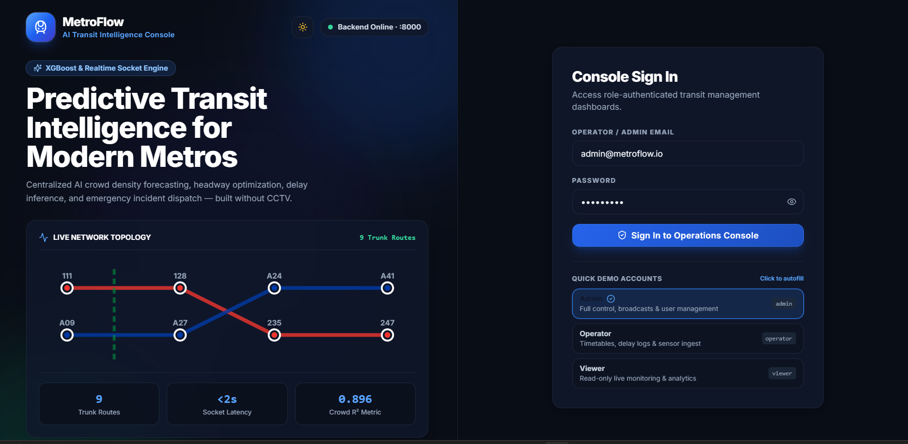

The **login page** (`/login`) authenticates against `/api/v1/auth/login` and stores a **JWT**
(signed HS256, expires after 12 h) in the browser. The page ships with **three demo roles**,
pre-filled and one-click fill buttons, so a reviewer can switch roles in seconds:

| Role | Email | Password | What it may do |
|---|---|---|---|
| Admin | `admin@metroflow.io` | `Admin@123` | Everything — broadcast alerts, manage users, ingest sensors, edit timetables |
| Operator | `operator@metroflow.io` | `Operator@123` | Timetables, delay logs, sensor ingest, alerts ack — no user management, no broadcasts |
| Viewer | `viewer@metroflow.io` | `Viewer@123` | Read-only monitoring & analytics |

Role-based access control is enforced **on the API**, not just hidden in the UI: every data
endpoint checks the caller’s role (`require_roles(ADMIN, OPERATOR, VIEWER)`), so a viewer’s access
token simply cannot create a user even if they hand-craft the request. New self-registrations are
always created as **viewer** — they cannot grant themselves operator rights.

---

## 6. Overview dashboard

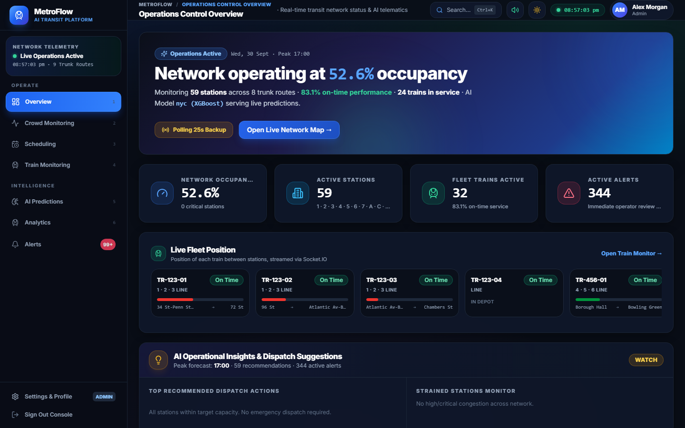

After login you land on the **Overview**, which answers “how healthy is the network right now?”
It loads six sources in parallel: `/analytics/overview`, `/crowd/live`, `/trains/live`,
`/analytics/traffic?hours=24`, recent `/alerts`, `/analytics/insights` and the model card.

- **KPI cards** — total stations (59 real MTA stops), trains in service, active schedules,
  **current network occupancy %** (average of the live snapshots), **open alerts**, and
  **on-time %** (from schedule statuses). A mentor tapping a card value should be told its formula
  (all in §3.2).
- **Most Congested Stations** — a ranked bar chart of the *live* per-station occupancy %
  (`/crowd/live`), each bar coloured by congestion rule (green→red). Hovering shows the exact
  value in a readable tooltip.
- **Network Traffic Trend (last 24 h)** — estimated hourly passenger throughput (thousands).
  The twin peaks you see are the morning and evening rush — the signature of realistic data.
- **AI Operational Insights** — a small NLP-feel panel that summarises the network state
  (“2 stations in ALERT”, “traffic 12 % above forecast”, …) computed from the same live sources.
- **Model provenance card (footer)** — which ML artifact is serving, on which city it was
  trained, and its real measured metrics, e.g. `GradientBoosting · R² 0.981 · trained on nyc`.
  This is **read from the artifact metadata**, never hard-coded.

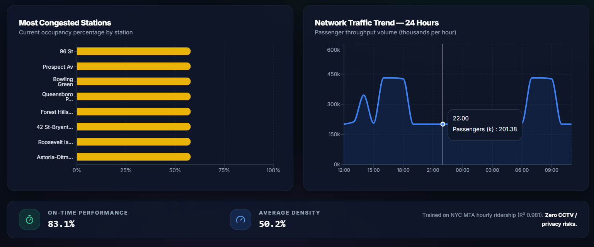

---

## 7. Crowd Monitoring

This page is the operational heart. It shows the network *as a map* and every station *as data*.

### 7.1 The map — three views

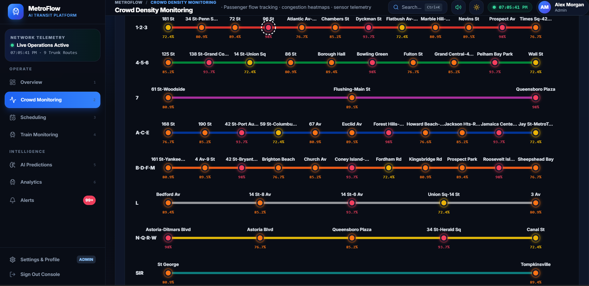

All three sit side by side in the same toggle, so you can switch between them without reloading
anything. None of them alters another — they are three readings of the same GTFS-derived data.

- **Schematic view** — the original one-track-per-trunk diagram, one continuous band per trunk.
- **Geographic view** — drawn from `/crowd/network` (496 real MTA stations at their real
  lat/lng, 578 real segments): actual New York geography, with the full subway as a faint base
  layer and monitored stations overlaid.
- **Connections view** — the same true lat/lng projection, but stripped back to the *monitored
  graph only* so the one-to-one link structure becomes the subject. Built from
  `/crowd/connections` (25 GTFS-derived edges: 21 along-line plus 4 walking connections between
  MTA stops).

Both map views plot real stations in their real positions and connect them in the real order the
GTFS timetable gives; the line between two stops is drawn straight. See §4.1 for exactly what that
does and does not mean.

**What the connections view adds.** With nothing selected the whole monitored graph is drawn
bright. Click any station and it isolates that junction completely:

- every station it is **not** directly linked to drops to 14% opacity, so the highlight reads
  instantly;
- each link it **does** have is drawn thicker, glows, and carries a chip naming the routes that
  serve it (e.g. `L`, `4/5`);
- every connected station gets a white ring plus its own live occupancy badge;
- a side panel repeats the same links as a one-to-one list, clickable to walk the network.

Only links genuinely **incident to the selected station** light up — an edge that merely passes
through one of its neighbours stays dimmed, so you never see a path highlighted that the station
does not actually serve.

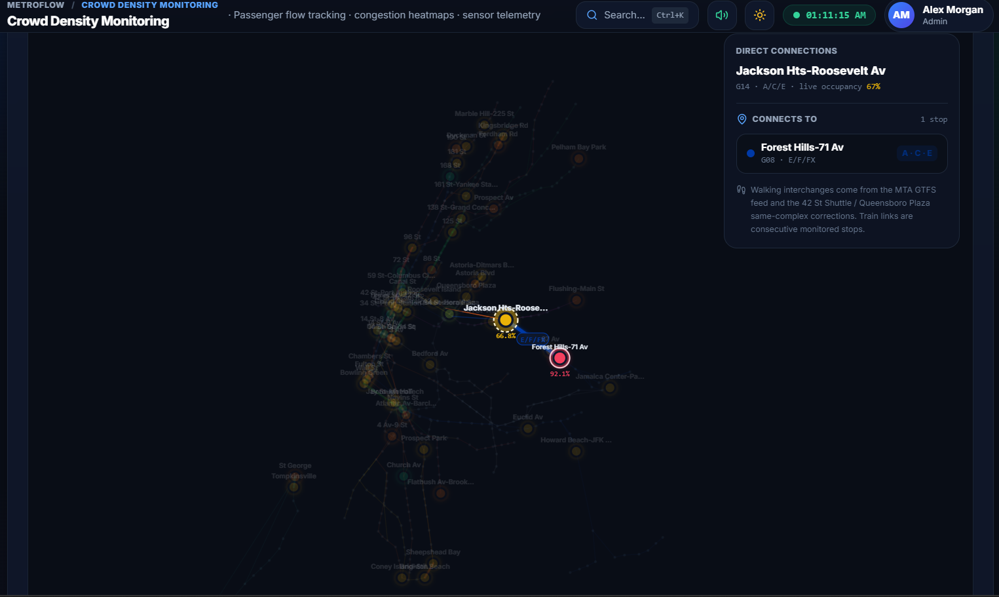

Stations are **coloured by live occupancy** (green→yellow→orange→red). You can toggle layers
(clusters, density) and search stations. Map data = real NYC (§4); occupancy = live snapshots
(§3.2).

### 7.2 The station list & heatmap

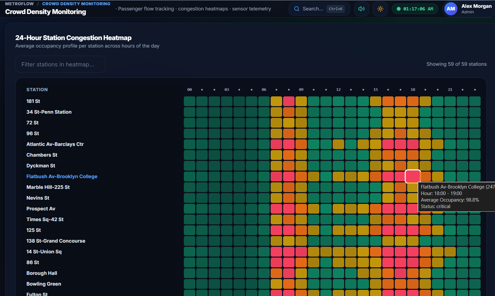

Beneath the map (or a side panel): 
- **Station cards** — one per station with current occupancy %, congestion badge, and capacity.
- **Heatmap** (`/crowd/heatmap`) — a station × hour grid of average occupancy %, the classic
  “which hours are worst at which station” matrix. Warm cells = heavy hours; the pattern shows
  morning peaks at commuter stations and evening peaks at downtown ones.

### 7.3 Selecting a station — history, telemetry & sensor ingest

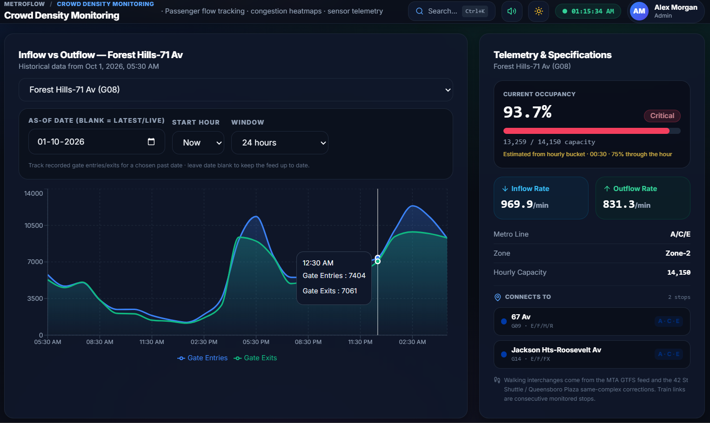

Click any station to open its detail:

- **Inflow vs Outflow (blue = entries, green = exits)** — drawn from `/crowd/station/{id}/history`.
  The default is the last 24 h of **live (recorded)** data. Use the **date + start-hour + hours**
  tracker to look at any past window; dates older than the stored history are **synthesised from
  the same deterministic daily curve** (weekend-aware, entries kept distinct from exits) so the
  chart always draws and always tells a realistic story.
- **Realtime telemetry** — current occupancy, capacity used, inflow/outflow rate, and a live
  count of sensor events, updated on a socket room while the station is selected.
- **Sensor ingest tool (operator/admin)** — a role-protected simulator that posts a synthetic
  gate event to `/crowd/ingest`, which flows straight into the live occupancy and alerts — a real
  “sensor → backend → chart → alert” round-trip to demo live.

---

## 8. Train Monitoring

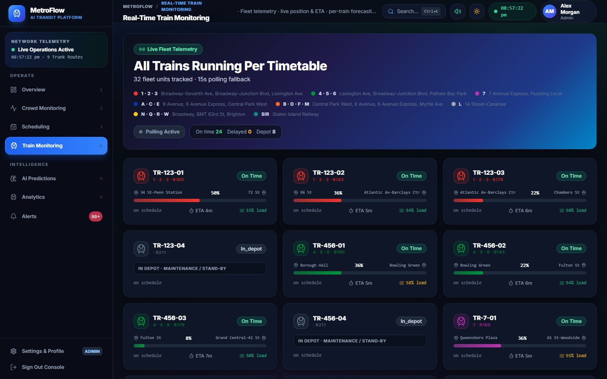

`/trains/live` builds a full **fleet view** from the schedule table: each train shows status
(`in_transit`, `at_station`, `delayed`, …), line, next station, ETA, headway, current load %, and
projected load.

- **Why these numbers are trustworthy:** station position and ETA are interpolated from the real
  schedule rows that bracket the simulated current time (`/trains/{id}/schedule`), then blended
  with the train’s delay state. Statuses come straight from the schedule rows, not from random.
- **Select a train** → a detail drawer with its timetable plus a 12-hour **crowd forecast for that
  train’s station** (`/predictions/train/{id}`), connecting the live picture to the ML layer.
- Every loaded train subscribes to a per-train socket room (`train:{id}`), so occupancy and ETA
  tick live without page refreshes.

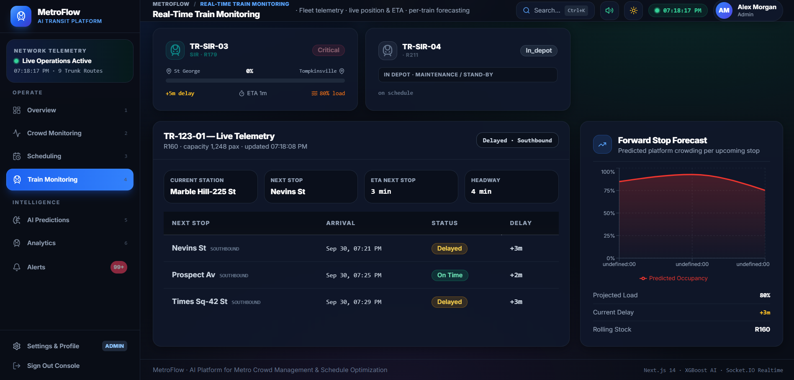

---

## 9. Scheduling Management & AI recommendations

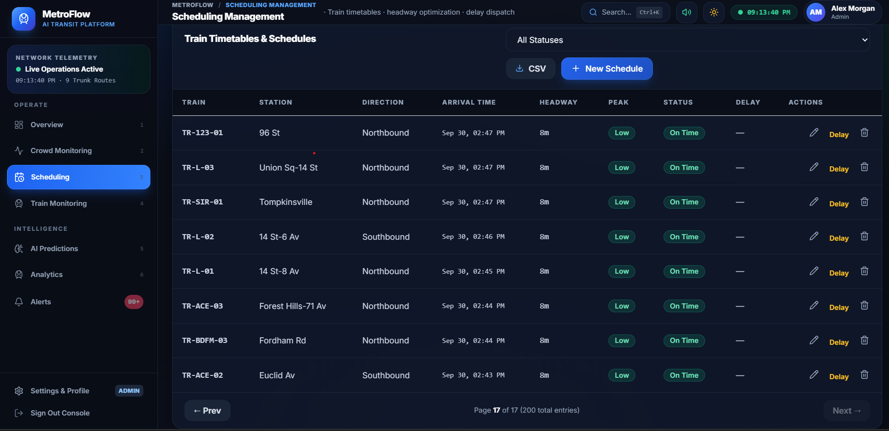

The timetable page reads `GET /scheduling/schedules?limit=200` and lets operators:

- **Search / filter / paginate** the timetable and **export CSV**.
- **Create / edit / delete** schedule rows (admin + operator; viewer read-only).
- **Report a delay** on any row (`POST /scheduling/delay/{id}`) — the backend then shifts the
  following stops by the delay, writes a ridership record, and raises a **delay alert** that
  appears everywhere instantly. This is the “cause an incident, watch the system react” demo move.
- **Apply Frequency** (`POST /scheduling/apply-headway/{station_id}`).

### 9.1 The AI recommendations — what exactly is ML here?

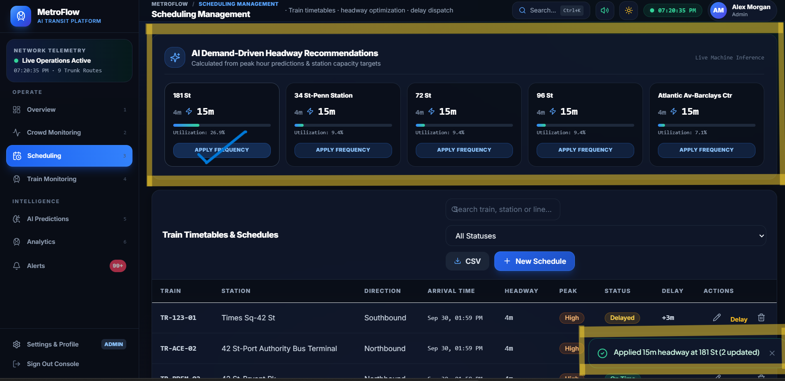

The top panel lists **recommendations** (`/predictions/recommendations`) — one per station — shown
as cards: `Current headway 8 min → Recommended 6 min · high priority`.

**Important honesty point:** the recommendation is **not** a neural network. It is a
**deterministic capacity solver**:

```
trains needed   = demand (passengers/hour) ÷ (train capacity × 85 %)
recommended     = round(120 ÷ trains needed), clamped to [3, 15] minutes
```

If the current headway is longer than the recommended one, the action is marked **high
priority** (“tighten service”); if current is already shorter, it is reported as **spare
capacity**, so the UI never recommends halving service while claiming demand is steady. The
“demand” input is the demand-model prediction, which *is* ML (§10) — so the chain is
**ML demand → deterministic solver → headway number**. Applying a recommendation re-writes the
station’s schedules, and the change is visible in the timetable and the train monitor immediately.

---

## 10. AI Predictions — the machine-learning heart

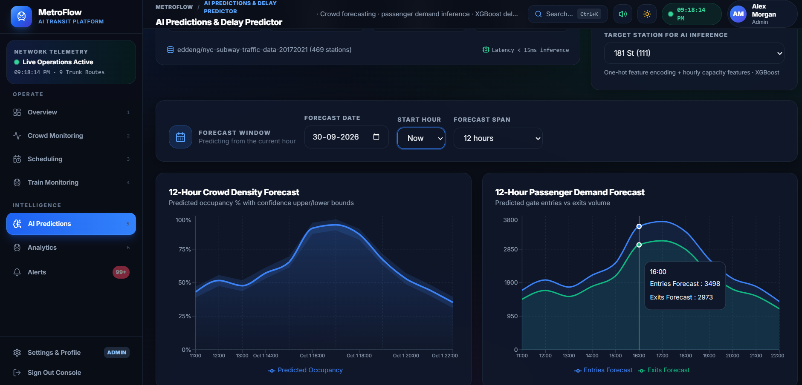

Two ML forecast charts, a delay predictor, and honest model cards in one page.

### 10.1 Crowd density forecast (occupancy with confidence band)

Pick a **station**, a **forecast window** (6 h … 72 h, this month “Now” or any past date), and the
chart draws the **predicted occupancy %** (blue area) with a **confidence band** (the shaded band
between the model’s lower and upper quantiles). Each tooltip shows `Predicted Occupancy` and
`Confidence Band`. This band is *not* decoration — it comes from a **quantile ensemble**
(§14.3): three Gradient-Boosting models trained for the 5th, 50th and 95th percentiles. The
distance between the pink lines *is* the model telling you how sure or unsure it is that hour.

### 10.2 Passenger demand forecast

The second chart predicts **entries vs exits** for the same window — blue entries, green exits —
right-shifted through the day so the peaks line up with the traffic trend. It also powers the
**“Forecasted Peak Demand”** card (busiest hour + expected passengers) and the scheduler’s
demand input.

### 10.3 Delay predictor (NJ Transit)

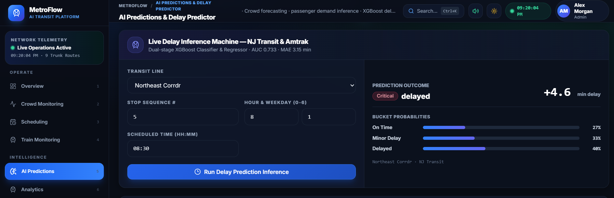

The third block is a **classification + regression** model trained on the real
**NJ Transit–Amtrak NEC on-time performance dataset (2018–2019)**:

- Inputs a reviewer can change: **route line** (Northeast Corridor, Raritan Valley, Main Line,
  Bergen County, Pascack Valley, Atlantic City, Princeton Shuttle), **stop sequence**, **hour**,
  **weekday**, **scheduled time**. The train type is fixed to *NJ Transit* because that is the
  only class present in the artifact’s vocabulary.
- Outputs: a **delay bucket** (e.g. `<5, 5–10, 10–20, >20 min`) — the classifier’s answer — a
  **probability per bucket**, and the regressor’s **expected delay in minutes**. The metrics card
  beside it shows the **real measured AUC / MAE read from the artifact**, so nobody quotes a
  made-up accuracy.

### 10.4 Model cards & provenance

The page headers (`ModelBadge`) display, per model: algorithm, city trained on, trained-on date,
`loaded / degraded` state and the measured metrics — e.g. crowd `R² 0.981 · MAE 0.029`,
demand `R² 0.969 · MAE 367`, delay `AUC · MAE · accuracy`. Same data is served to the Overview
footer. The app never hard-codes these numbers.

---

## 11. Alerts Centre

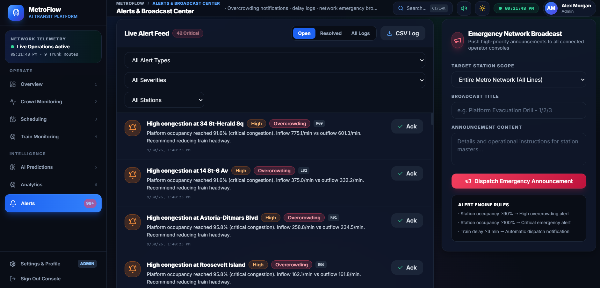

`/alerts` lists every alert (type, severity, station, timestamp), filterable by type
(`overcrowding`, `delay`, `emergency`, `info`) and by station, searchable, paginated.

- **Sources of alerts:** (a) the seeder ships two known alerts; (b) occupancy snapshots crossing
  thresholds raise `overcrowding` alerts; (c) reporting a schedule delay raises a `delay` alert;
  (d) admins **broadcast** an `emergency` to everyone (visible in all dashboards and pushed over
  the socket).
- **Acknowledge** (`POST /alerts/{id}/acknowledge`, operator+) closes it out of the active count —
  and the Overview’s “Open Alerts” KPI drops immediately, which is a satisfying live demo.
- Emergency broadcasts are the only place an alert is pushed to **all** viewers, not just a
  station room.

---

## 12. Analytics & Executive Reports

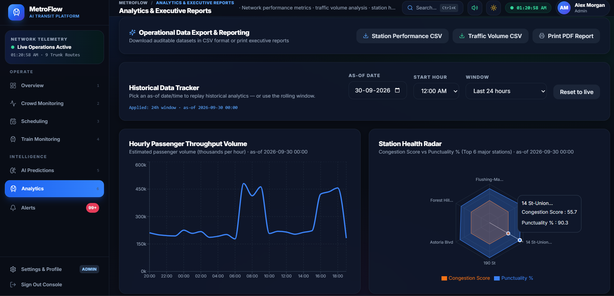

This page turns the same live data into **executive reporting**. A single **Historical Data
Tracker** (as-of date, start hour, window) drives *everything* below, so a mentor can replay the
entire report for any 24 h / 48 h / 72 h / 7-day window.

- **KPIs** — on-time %, avg occupancy, delayed services, open alerts.
- **Hourly Passenger Throughput Volume** — the traffic curve (thousands/hour) from §3.2.
- **Station Health Radar** — the **Top 6 major stations**, plotting *congestion score* against
  *punctuality %* on two axes. A station far along the orange (congestion) axis and short on the
  blue (punctuality) axis is the one to fix.
- **Station Performance Detailed Report** — a table ranked by congestion score: avg / peak
  occupancy, entries & exits totals for the window, punctuality rate, with a colour-coded
  congestion bar. Both traffic and this table can be **exported as CSV** and the page printed to
  PDF — the “executive report” story.
- **`{window}-Hour Average Occupancy per Station`** — the bar chart (the “72-Hour” chart in the
  screenshot). Each bar is a station’s mean occupancy over the window, **coloured by congestion
  rule** (green→red) and rendered tallest-first; hovering shows the readable value. Same metric,
  whole network in one glance.

---

## 13. Settings & User Management

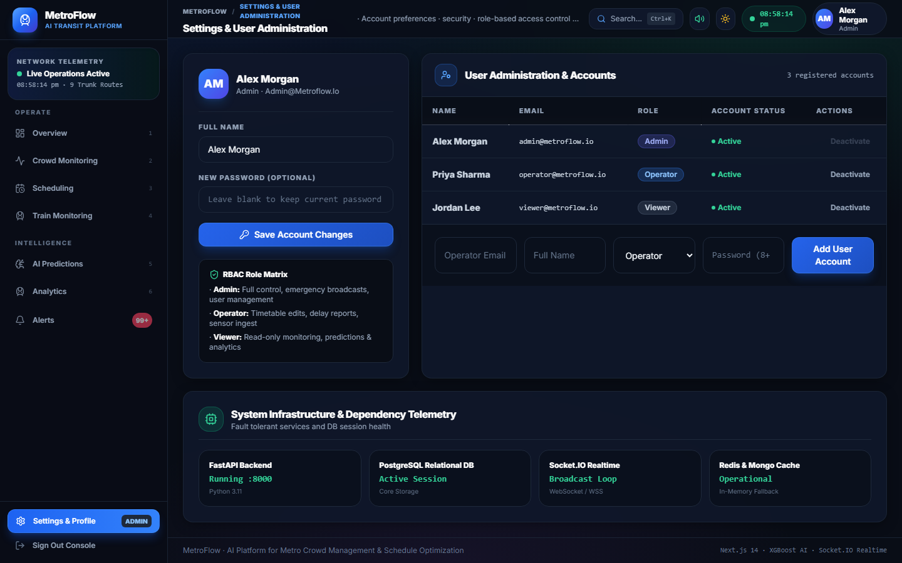

- **Profile** — edit your display name / password (`PUT /users/me`).
- **User Management (admin only)** — see all users, **create operators**, **deactivate** accounts.
  Because self-registration is locked to viewer, this is the only legit way an operator is born —
  reinforcing the RBAC story from §5.

---

## 14. The machine-learning techniques, and exactly where each is used

*“Where the ML is used? Which techniques? And where is there no ML — why?”*
Here is the complete, honest map.

### 14.1 Gradient-Boosting Regression (crowd occupancy) — scikit-learn

**Where:** the per-station hourly crowd forecast on the Predictions page
(`/predictions/crowd`, served by the NYC crowd artifact).

**What it is:** a boosted ensemble of shallow decision trees. Each new tree is
trained to correct the *residual* (the error) of all previous trees, so it squeezes accuracy out
of noisy passenger data. It is chosen because it handles skewed, non-linear, tabular transit data
well with modest feature engineering.

**Features (67 of them):** the shape of the hour encoded with `hour_sin/hour_cos` so the model knows
23:00 and 00:00 are neighbours; `is_peak`, weekday, a **one-hot** of the station id, and the
station’s normalised `capacity_per_hour`. Measured: **R² 0.981, MAE 0.029** on a 7-day holdout.

### 14.2 Gradient-Boosting Regression (passenger demand)

**Where:** `/predictions/demand` (entries/exits forecast) — same feature family, same family of
model. Measured: **R² 0.969, MAE ≈ 367 pax/hour** (the larger MAE is just the scale — thousands of
passengers, not percentages).

### 14.3 Quantile ensemble — prediction intervals

**Where:** the **confidence band** around the crowd forecast.

**What it is:** instead of one model that predicts the *average*, train **three**
identical Gradient-Boosting models whose targets are the 5th, 50th and 95th **quantiles**. The
5th- and 95th-quantile lines bracket where the true value is likely to fall ~90 % of the time.
This is a cheap, robust way to get **uncertainty**, rather than a single point that invites the
mentor question “how sure are you?”. The band therefore *widens* at erratic peak hours and
*narrows* at stable overnight hours — and the code also draws metrics for interval *coverage*.

### 14.4 XGBoost — delay classification + regression (NJ Transit)

**Where:** `/predictions/delay`.

**What it is:** XGBoost is an optimised gradient-boosted tree library. The project uses **two**
models from the trained artifact: a **multiclass classifier** over delay brackets
(`<5 / 5–10 / 10–20 / >20 min`) giving a probability *per bucket*, and a **regressor** giving the
expected delay in minutes. Inputs are route-line + train-type + stop number + time features
(hour, weekday, scheduled minutes), one-hot where categorical. Real dataset:
NJ Transit–Amtrak NEC 2018–2019. The UI serves **measured AUC / MAE from the artifact metadata**.

### 14.5 Feature engineering — the shared recipe

All crowd/demand models share: `hour_sin/cos` (cyclic time), `is_peak` (07–09, 16–18), `weekday`,
station **one-hot** encoding, and station `capacity_per_hour` normalised by the max capacity seen
in training. Delay models use line/type one-hot + numeric stop sequence + time features.

### 14.6 Where ML is deliberately NOT used — and why that is a feature

- **Headway recommendation** is a deterministic capacity solver (§9.1). ML would add nothing but
  opacity to a reversible arithmetic formula — and being able to *explain* it in one line is a
  strength for operators.
- **Network traffic** and **on-time %** come from schedule records. They would be *wrong* if a
  model guessed them, because they are ground-truth facts about the simulated network.
- There is **no computer vision** in the project — crowd levels are inferred from sensor
  telemetry, not live security-camera video (a privacy choice you can mention).

### 14.7 Degradation without lying

If an artifact is missing, the crowd/demand API returns the **rule-based baseline curve** and
flags itself `degraded` in the model badge. The delay endpoint has **no synthetic fallback** — it
errors cleanly if the artifact is absent. Either way, the UI tells the truth about which numbers
are model-derived.

---

## 15. Every graph in the app, decoded

| Page | Chart | Data source | What the shape means |
|---|---|---|---|
| Overview | Most Congested Stations (bars) | `/crowd/live` occupancy % | rush-hour peak at each station; tallest = worst right now |
| Overview | Network Traffic Trend (line) | `/analytics/traffic?hours=24` | morning + evening peaks ⇒ realistic demand curve |
| Crowd | Geographic map | `/crowd/network` (real MTA stations + real adjacency; straight-line segments, §4.1) | live occupancy colours across real geography |
| Crowd | Schematic map | `/crowd/connections` (GTFS edges) | transfer hubs and line structure |
| Crowd | Connections view | `/crowd/connections` + `/crowd/network` | isolates one junction: lit links, route chips, occupancy badges, side-panel list |
| Crowd | Heatmap grid | `/crowd/heatmap` | station × hour average occupancy matrix |
| Crowd | Inflow vs Outflow (lines) | `/crowd/station/{id}/history` | entries vs exits balance; out-of-window dates re-synthesised |
| Trains | Fleet list badges | `/trains/live` | status/ETA/load per train from schedule rows |
| Trains | Train detail forecast | `/predictions/train/{id}` | 12 h crowd outlook for that train’s station |
| Scheduling | Recommendation cards | `/predictions/recommendations` | current vs recommended headway + priority |
| Scheduling | Timetable table | `/scheduling/schedules?limit=200` | all scheduled arrivals, editable |
| Predictions | Crowd Density Forecast (area + band) | `/predictions/crowd` | mean forecast with quantile confidence band |
| Predictions | Demand forecast (areas) | `/predictions/demand` | entries vs exits; drives peaks + scheduling |
| Predictions | Delay predictor (probabilities) | `/predictions/delay` | delay bucket distribution + expected minutes |
| Alerts | Alert list | `/alerts` | live incident feed, filterable, acknowledgeable |
| Analytics | Hourly Throughput (line) | `/analytics/traffic?hours={24/48/72/168}` | same curve, any historical window |
| Analytics | Station Health Radar | `/analytics/station-performance` | congestion vs punctuality, top 6 stations |
| Analytics | Occupancy per Station (bars) | station-performance avg | mean occupancy, coloured by congestion rule |
| Analytics | Perf. report table | station-performance | ranked worst-first, exportable CSV |

---

## 16. How the live/real-time updates work

- **Socket.IO** pushes live state. The front-end joins rooms: `join_station:{stationId}` while a
  station is selected, `join_train:{trainId}` per selected train; admin **emergency broadcasts**
  go to all clients. Polling backups (25 s) guarantee charts still update if the socket drops.
- Anonymous reads of the *public* live feed are allowed so shares/embeds work, but every mutating
  endpoint demands a valid JWT and the right role.
- Sensor ingest posts a gate event → backend recomputes the station snapshot → socket pushes it →
  the chart and the alert feed update without a browser refresh. That full round-trip is one of
  the best live demo moments.

---

## 17. How the system is protected

- **Authentication:** JWT (HS256) via `/auth/login`; tokens expire after 12 h; profile endpoint
  for the logged-in user.
- **Authorisation:** role-based decorators on *every* data endpoint (admin / operator / viewer);
  self-registration always creates a viewer.
- **Secrets hygiene:** the app fails fast in production if a development secret, the demo seed, or
  a wildcard CORS origin is detected — the demo passwords exist only for local/dev runs.
- **Error handling:** generic internal-error responses (no stack traces leaked); gracefully
  staged API to avoid data exposure.
- **CORS:** locked to allowed origins in production.

---

## 18. How we know the system is correct & fast

- **Back end:** **179 automated tests** (pytest) — 54 API, 27 simulation, 21 timezone, 19 ML
  artifact, 14 cache/live, 10 feature, 10 model-wrapper, 8 connections, 8 network, 8 scheduling
  advice. They cover the delay-vocabulary edge cases, deterministic schedule grids, out-of-window
  history synthesis, per-station factor spread (regression against the old 7-value collapse),
  hourly traffic scaling, and every auth/RBAC path.
- **Front end:** **45 tests** (Vitest) + full TypeScript type-check + ESLint + production build,
  all green. Includes the `linkTouches` predicate that keeps map highlighting to genuine one-hop
  links.
- **CI:** on every push/PR a pipeline runs the Python test job and a Docker image build job (the
  `.dockerignore` fix removed the bloated `data/` directory from the broker). Also covered in
  docs: latency budgets and prediction-interval coverage measures.
- A mentor pressing refresh over and over should be told: *the numbers are deterministic by
  construction, so repeated calls return the same values unless the simulated hour actually
  changed.*

---

## 19. How the system is deployed

- **Docker Compose** orchestrates Postgres, Mongo, Redis, backend, frontend; backend image built
  by CI on every branch so the branch (yours) always has a buildable image.
- Docs cover **Kubernetes** manifests and **cloud** deployment (AWS/Azure) with health-check
  endpoint `/api/v1/health` used by probes and the login page.
- Config via environment variables; `.env.example` documents every knob; production fail-fast
  guards (§17) ship in the same image.

---

## 20. The live walkthrough — what to show, click by click

A ≈ 10 minute demo that hits every selling point:

1. **Login** — open `/`, pick **Admin**, sign in; mention the two other roles and show one fast
   re-login as **Viewer** later to prove RBAC greys out actions.
2. **Overview** — explain each KPI’s formula, hover the congested-stations tooltip (readable!),
   point at the traffic twin peaks, and read the model card aloud (R² 0.981).
3. **Crowd** — switch map view schematic ↔ geographic ↔ connections (real NYC!), click a station →
   history chart; pick a date → the timeline re-draws. Then, as Operator, post a fake sensor event and
   watch the station’s data/alert react *live*.
4. **Trains** — open a train, show its detail + forecast; note per-train push updates.
5. **Scheduling** — show the recommendation cards, explain the no-ML solver honestly, hit
   **Apply Frequency** and point at the changed timetable; then **report a delay** on a row and
   watch the alert appear.
6. **Predictions** — the headline: crowd forecast with its **confidence band** (explain quantile
   technique), demand forecast, then the **NJ Transit delay predictor** — change the line and
   hour and show the probabilities change; read measured AUC/MAE.
7. **Alerts** — acknowledge everything; KPI “Open Alerts” drops.
8. **Analytics** — set the tracker to *72 hours*, show traffic, radar, table, and the
   72-Hour Occupancy bar chart with its colour legend; export a CSV and print to PDF.
9. **Settings** — as Admin, create an Operator account; log back in as that operator to show the
   post-login landing.

---

## Appendix A — One-line facts sheet

- Number types: **persistent DB records · live derived values · ML predictions** — never random.
- Map & stations: **real MTA NYC** (59 stops, 496-station geographic network, GTFS connections).
- ML locations: **crowd occupancy** (GBR), **demand** (GBR), **confidence band** (quantile GBM
  ensemble), **delay** (XGBoost classifier + regressor). 
- Not ML on purpose: **headway suggestion** = deterministic capacity solver; traffic/on-time =
  DB facts; no CV.
- Measured performance: crowd **R² 0.981**, demand **R² 0.969**, delay **AUC/MAE from artifact**.
- Deterministic seed explains reproducible numbers: **same hour → same numbers**.
- Roles: **Admin / Operator / Viewer**, enforced on the API with JWT + `require_roles`.
- Tests: **179 back-end pytest + 45 front-end Vitest**, tsc + ESLint + build green; CI builds the
  Docker image on every push.
- Tech: FastAPI · Next.js 14 · Postgres/Redis/Mongo · Recharts · Socket.IO · scikit-learn/XGBoost.

---

## Appendix B — Screenshot checklist

Captured each image from the **live demo** (folder: `docs/images/`
— the markdown references `images/...` relative to this file). All 16 screenshots have already been
captured into `docs/images/` from the running app.

| # | File | How to capture it |
|---|---|---|
| 01 | `images/01-login.png` | `/` login page, show the three demo-account quick-fill cards |
| 02 | `images/02-overview.png` | Overview after login (all KPI cards + congested bars + traffic trend) |
| 03 | `images/03-overview-tooltip.png` | Hover the tallest congested-station bar so the tooltip value is visible |
| 04 | `images/04-crowd-map.png` | Crowd page, geographic map view with station colours |
| 05 | `images/05-crowd-heatmap.png` | Crowd page heatmap grid (station × hour) |
| 06 | `images/06-crowd-history.png` | Selected station Inflow vs Outflow with the date tracker visible |
| 07 | `images/07-train-monitoring.png` | Trains page fleet list with status/Load/ETA columns |
| 08 | `images/08-train-detail.png` | A train’s detail drawer incl. its 12 h forecast chart |
| 09 | `images/09-scheduling.png` | Scheduling page: recommendation cards + timetable |
| 10 | `images/10-scheduling-apply.png` | After “Apply Frequency” — changed headways visible / toast |
| 11 | `images/11-predictions-crowd.png` | Predictions: crowd forecast area + confidence band, tooltip open |
| 12 | `images/12-predictions-delay.png` | Predictions: delay predictor form + probability output + metrics |
| 13 | `images/13-alerts.png` | Alerts Centre list with filters |
| 14 | `images/14-analytics.png` | Analytics: traffic + radar + 72-Hour occupancy bar chart |
| 15 | `images/15-settings.png` | Settings: user-management table (admin view) |
| 16 | `images/16-crowd-connections.png` | Crowd page, **connections** view with a station selected: lit links, route chips, occupancy badges, side-panel list |